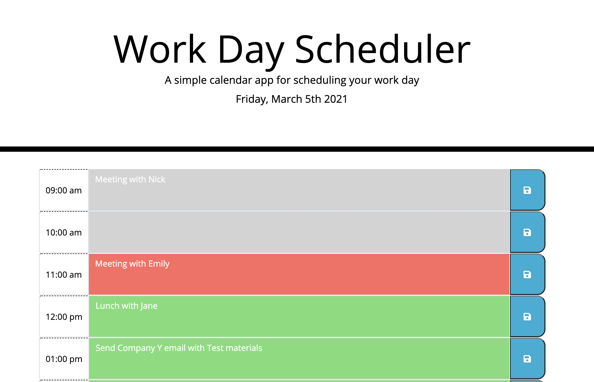

# Work Day Scheduler

## Description

A calendar application that allows a user to save events for each hour of the day. This app runs in the browser and features dynamically updated HTML and CSS powered by jQuery. It also utilizes the [Moment.js](https://momentjs.com/) library to work with date and time. 

Deployed link: https://mackenzielc.github.io/homework-5/ 




## User Story

```md
AS AN employee with a busy schedule
I WANT to add important events to a daily planner
SO THAT I can manage my time effectively
```

## Acceptance Criteria

```md
GIVEN I am using a daily planner to create a schedule
WHEN I open the planner
THEN the current day is displayed at the top of the calendar
WHEN I scroll down
THEN I am presented with timeblocks for standard business hours
WHEN I view the timeblocks for that day
THEN each timeblock is color coded to indicate whether it is in the past, present, or future
WHEN I click into a timeblock
THEN I can enter an event
WHEN I click the save button for that timeblock
THEN the text for that event is saved in local storage
WHEN I refresh the page
THEN the saved events persist
```

## Resources Used
* https://getbootstrap.com/docs/4.0/components/jumbotron/ 
* https://getbootstrap.com/docs/4.0/components/input-group/ 